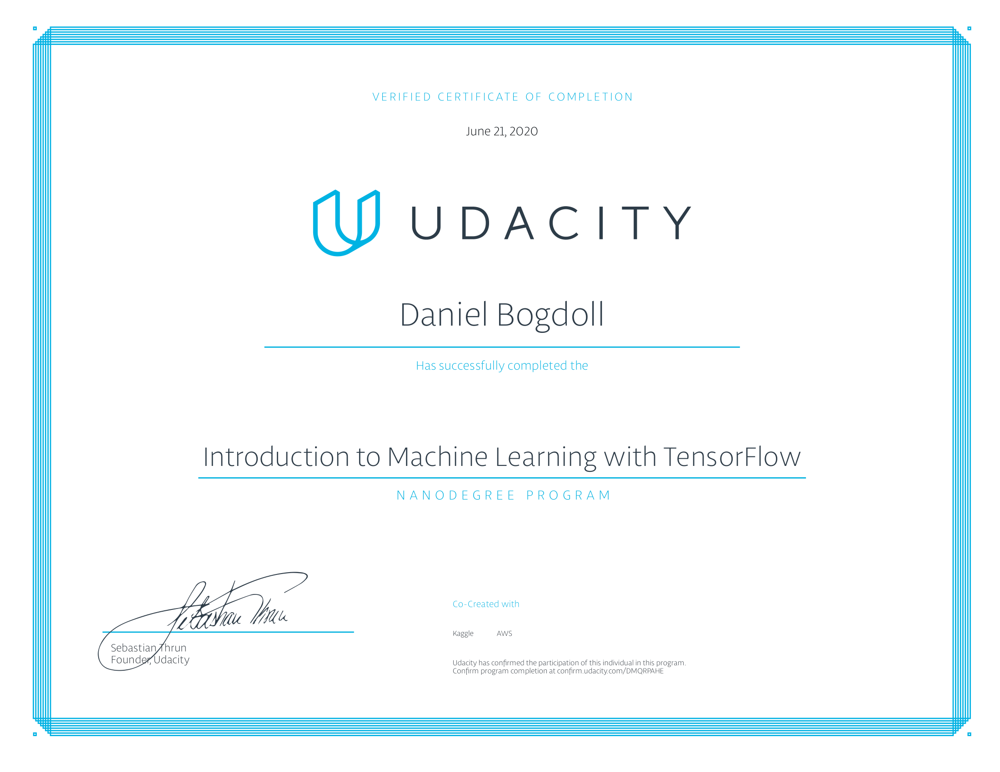
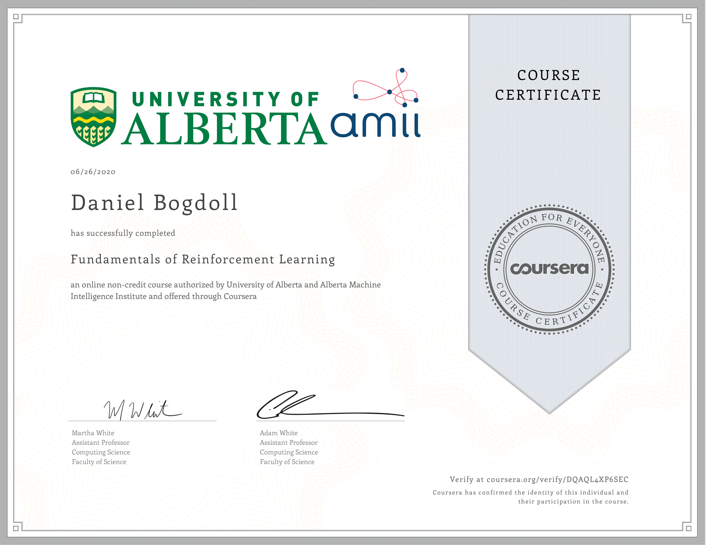

# Machine Learning

This repository covers my participation in the courses

:white_check_mark: [RWTH Computer Vision](https://www.vision.rwth-aachen.de/course/22/) (2018)\
:white_check_mark: [RWTH Artificial Neural Networks](https://online.rwth-aachen.de/RWTHonline/pl/ui/$ctx/WBMODHB.wbShowMHBReadOnly?pKnotenNr=1543&pOrgNr=14549) (2019)\
:white_check_mark: [RWTH Machine Learning](https://www.vision.rwth-aachen.de/course/31/) (2019)\
:white_check_mark: [RWTH Data Mining in the Domain of Technical Processes](https://online.rwth-aachen.de/RWTHonline/ee/ui/ca2/app/desktop/#/slc.tm.cp/student/courses/329079?$ctx=design=ca;lang=en) (2019)\
:white_check_mark: [Udacity Machine Learning Nanodegree](https://www.udacity.com/course/intro-to-machine-learning-with-tensorflow-nanodegree--nd230) (2020)\
:white_check_mark: [Coursera Reinforcement Learning: Fundamentals](https://www.coursera.org/learn/fundamentals-of-reinforcement-learning) (2020)\
:white_check_mark: [Coursera Reinforcement Learning: Sample-based Learning Methods](https://www.coursera.org/learn/sample-based-learning-methods) (2020)\
:soon: [Deep Reinforcement Learning Course](https://simoninithomas.github.io/Deep_reinforcement_learning_Course/)

## Overview
The courses cover the tiers of machine learning regularly recognized today:
### Supervised Learning
Studying labeled data, these techniques can extend patterns to unlabeled data.
Classification: Categorial Outcomes
Regression: Numeric Outcomes
Deep learning can be used within supervised machine learning to create techniques that are better at image recognition or identifying when a movie was created based on the video footage.

### Unsupervised Learning
By learning patterns even when data do not have labels, these techniques can group items together that are likely to be similar.

### Reinforcement Learning
By rewarding actions, these techniques focus on finding a balance between exploration (of uncharted territory) and exploitation (of current knowledge).

## [Biological Modelling](https://github.com/slisystem/machine_learning/tree/master/0_Introduction/Biology)
- 1: Hodgkin-Huxley
- 2: Integrate-And-Fire
- 3: Transmitter-activated ion channels
- 4: Synaptic Plasticity

## [Supervised Learning](https://github.com/slisystem/machine_learning/tree/master/1_Supervised)
- 1: Introduction
- 2: Linear Regression
- 3: Perceptron Algorithm
- 4: Decision Trees
- 5: Naive Bayes
- 6: Support Vector Machines
- 7: Ensemble Methods
- 8: Model Evaluation Metrics
- 9: Training and Tuning
- 10: Project: Income Prediction
- 11: Genetic Algorithms

### [Deep Learning](https://github.com/slisystem/machine_learning/tree/master/2_Deep)
- 1: Introduction
- 2: Gradient Descent
- 3: Training Techniques
- 4: TensorFlow Usage
- 5: Project: Image Classification
- 6: Convolutional Neural Networks CNN
- 7: Recurrent Neural Networks RNN

## [Unsupervised Learning](https://github.com/slisystem/machine_learning/tree/master/3_Unsupervised/)
- 1: K-Means Clustering
- 2: Hierarchical and Density Clustering
- 3: Gaussian Mixture Model Clustering
- 4: Dimensionality Reduction and PCA
- 5: Random Projection and ICA
- 6: Project: Customer Segment Identification
- 7: Self-Organizing Map SOM
- 8: Adaptive Resonance Theory ART
- 9: Pulse-coupled Neural Networks PCNN

## [Reinforcement Learning](https://github.com/slisystem/machine_learning/tree/master/4_Reinforcement/)
- 1: Exploration-Exploitation Trade-Off
- 2: Markov Decision Processes
- 3: Value Functions & Bellman Equations
- 4: Dynamic Programming
- 5: Monte Carlo Methods
- 6: Temporal Difference Learning
- 7: SARSA & Q-Learning
- 8: Dyna Architecture
- 9: Neural Network Function Approximation

