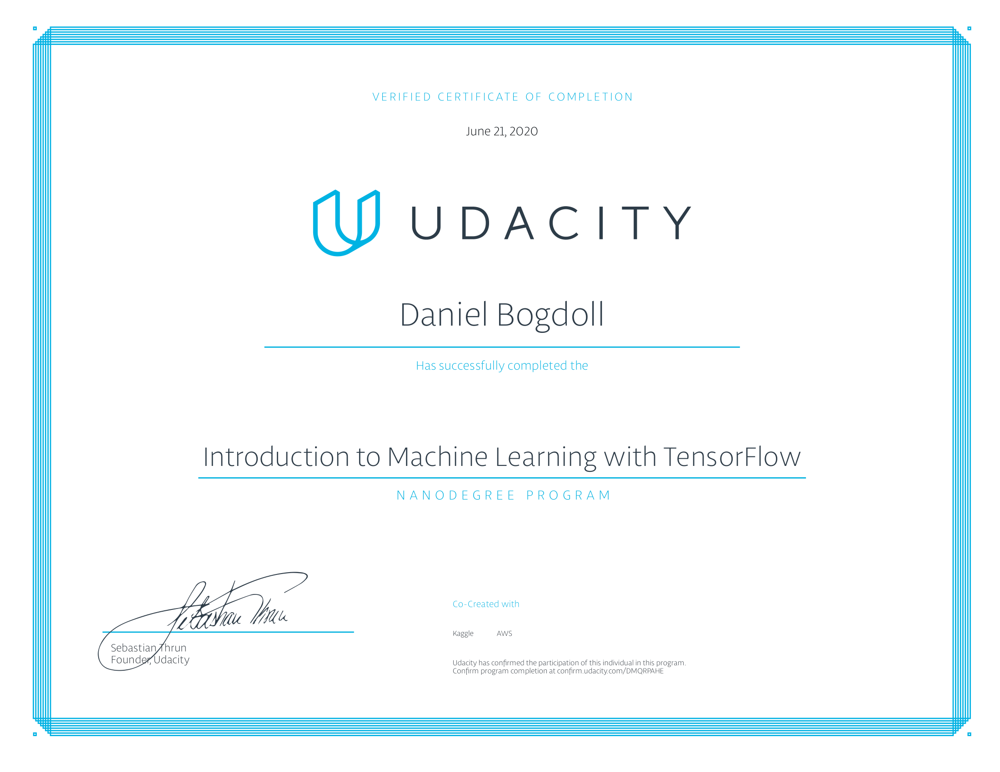

# Udacity Machine Learning

This repository covers my participation in the courses
- [Udacity Machine Learning Nanodegree](https://www.udacity.com/course/intro-to-machine-learning-with-tensorflow-nanodegree--nd230) and
- [Coursera Reinforcement Learning](https://www.coursera.org/specializations/reinforcement-learning)

## Overview
The courses cover the tiers of machine learning regularly recognized today:
### Supervised Learning
Studying labeled data, these techniques can extend patterns to unlabeled data.
Classification: Categorial Outcomes
Regression: Numeric Outcomes
Deep learning can be used within supervised machine learning to create techniques that are better at image recognition or identifying when a movie was created based on the video footage.

### Unsupervised Learning
By learning patterns even when data do not have labels, these techniques can group items together that are likely to be similar.

### Reinforcement Learning
By rewarding actions, these techniques focus on finding a balance between exploration (of uncharted territory) and exploitation (of current knowledge).

## [Supervised Learning](https://github.com/slisystem/udacity_ml/tree/master/1_Supervised)
- 1: Introduction
- 2: Linear Regression
- 3: Perceptron Algorithm
- 4: Decision Trees
- 5: Naive Bayes
- 6: Support Vector Machines
- 7: Ensemble Methods
- 8: Model Evaluation Metrics
- 9: Training and Tuning
- 10: Project: Income Prediction

### [Deep Learning](https://github.com/slisystem/udacity_ml/tree/master/2_Deep)
- 1: Introduction
- 2: Gradient Descent
- 3: Training Techniques
- 4: TensorFlow Usage
- 5: Project: Image Classification

## [Unsupervised Learning](https://github.com/slisystem/udacity_ml/tree/master/3_Unsupervised/)
- 1: K-Means Clustering
- 2: Hierarchical and Density Clustering
- 3: Gaussian Mixture Model Clustering
- 4: Dimensionality Reduction and PCA
- 5: Random Projection and ICA
- 6: Project: Customer Segment Identification

## Reinforcement Learning
- 1: K-Armed Bandit 
- 2: Markov Decision Processes
- 3: Values Functions & Bellman Equations
- 4:Dynamic Programming

